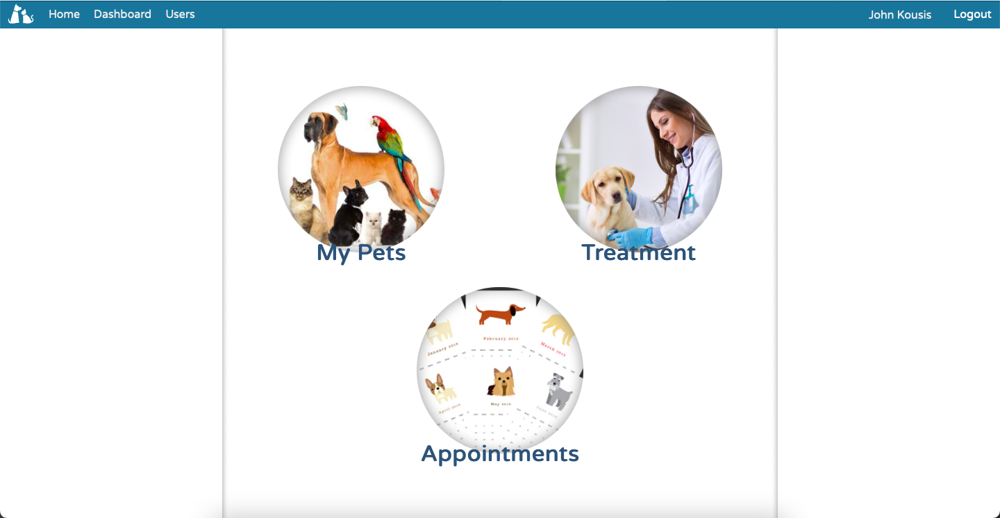
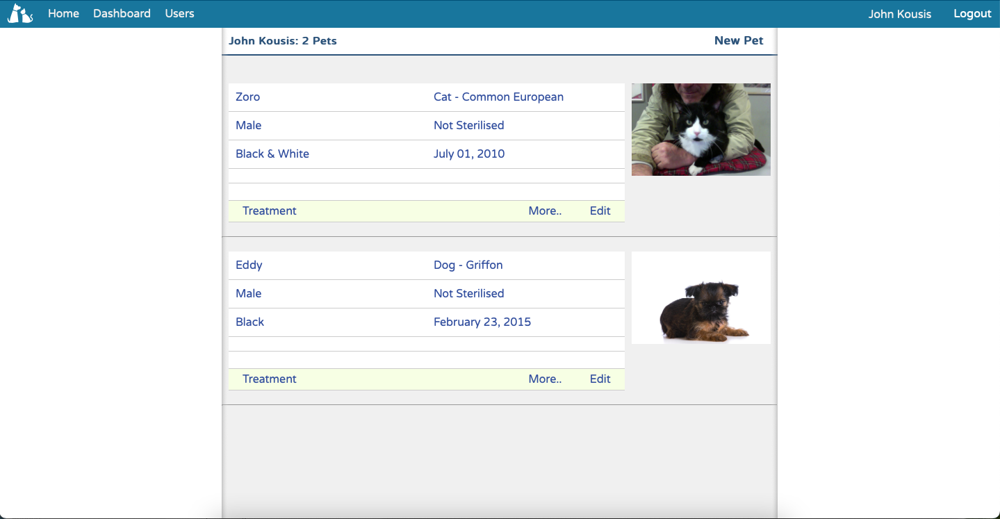

# PetCare - a pet lovers' application

### The project aims for pet owners to track their treatment. Pet owners have to login to the application and insert information about any number of pets they own. They can record any event of their pets’ lives like vaccinations, illnesses, nutrition, grooming, weight control, everyday hobbies etc. . Also, users can schedule appointments with a vet or a groomer.

<!--
*** Thanks for checking out this README Template. If you have a suggestion that would
*** make this better, please fork the repo and create a pull request or simply open
*** an issue with the tag "enhancement".
*** Thanks again! Now go create something AMAZING! :D
-->

<!-- PROJECT SHIELDS -->
<!--
*** I'm using markdown "reference style" links for readability.
*** Reference links are enclosed in brackets [ ] instead of parentheses ( ).
*** See the bottom of this document for the declaration of the reference variables
*** for contributors-url, forks-url, etc. This is an optional, concise syntax you may use.
*** https://www.markdownguide.org/basic-syntax/#reference-style-links
-->

[![Contributors][contributors-shield]][contributors-url]
[![Forks][forks-shield]][forks-url]
[![Stargazers][stars-shield]][stars-url]
[![Issues][issues-shield]][issues-url]

<!-- PROJECT LOGO -->
 

  
  
  <h3 align="center">PetCare Application</h3>
  
  

    This project is part of my work with Ruby on Rails !
     
    <a href="https://github.com/ioanniskousis/PetCare"><strong>Explore the docs</strong></a>
     
     
    <h1 style="text-align: center"><a href="https://jk-petcare.herokuapp.com">Working Demo</a></h1>
    <a href="https://github.com/ioanniskousis/PetCare/issues">Report Bug</a>
    <a href="https://github.com/ioanniskousis/PetCare/issues">Request Feature</a>
  

 

<!-- TABLE OF CONTENTS -->

- [Screen Shots](#application-screen-shots)
- [About the Project](#about-the-project)
- [Entities Relationship Diagram](#erd)
- [Live Version](#live-version)
- [Application Instructions](#application-instructions)
- [System Requierments](#system-requierments)
- [Dependencies](#dependencies)
- [Configuration](#configuration)
- [Development](#development)
- [Built With](#built-with)
- [Contributors](#contributors)
  

## Application Screen Shots

#### Dasshboard

#### Pets Index

<!-- LIVE VERSION -->

## Live version

## You can see it working 

# README

This README would normally document whatever steps are necessary to get the
application up and running.

Things you may want to cover:

* Ruby version

* System dependencies

* Configuration

* Database creation

* Database initialization

* How to run the test suite

* Services (job queues, cache servers, search engines, etc.)

* Deployment instructions

* ...

<!-- MARKDOWN LINKS & IMAGES -->
<!-- https://www.markdownguide.org/basic-syntax/#reference-style-links -->

[contributors-shield]: https://img.shields.io/github/contributors/ioanniskousis/Opinions.svg?style=flat-square
[contributors-url]: https://github.com/ioanniskousis/Opinions/graphs/contributors
[forks-shield]: https://img.shields.io/github/forks/ioanniskousis/Opinions.svg?style=flat-square
[forks-url]: https://github.com/ioanniskousis/Opinions/network/members
[stars-shield]: https://img.shields.io/github/stars/ioanniskousis/Opinions.svg?style=flat-square
[stars-url]: https://github.com/ioanniskousis/Opinions/stargazers
[issues-shield]: https://img.shields.io/github/issues/ioanniskousis/Opinions.svg?style=flat-square
[issues-url]: https://github.com/ioanniskousis/Opinions/issues
