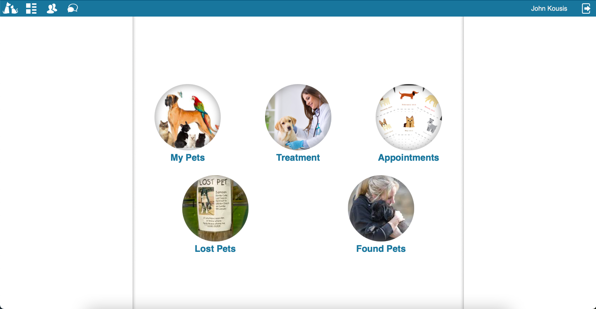

# PetCare - a pet lovers' application

### The project aims for pet owners to track their treatment. Pet owners have to login to the application and insert information about any number of pets they own. They can record any event of their pets’ lives like vaccinations, illnesses, nutrition, grooming, weight control, everyday hobbies etc. . Also, users can schedule appointments with a vet or a groomer.
<hr/>
<br/><br/>

<!--
*** Thanks for checking out this README Template. If you have a suggestion that would
*** make this better, please fork the repo and create a pull request or simply open
*** an issue with the tag "enhancement".
*** Thanks again! Now go create something AMAZING! :D
-->

<!-- PROJECT SHIELDS -->
<!--
*** I'm using markdown "reference style" links for readability.
*** Reference links are enclosed in brackets [ ] instead of parentheses ( ).
*** See the bottom of this document for the declaration of the reference variables
*** for contributors-url, forks-url, etc. This is an optional, concise syntax you may use.
*** https://www.markdownguide.org/basic-syntax/#reference-style-links
-->

[![Contributors][contributors-shield]][contributors-url]
[![Forks][forks-shield]][forks-url]
[![Stargazers][stars-shield]][stars-url]
[![Issues][issues-shield]][issues-url]

<br/><br/>


<!-- PROJECT LOGO -->
<br />
<p align="center">
  <a href="https://github.com/ioanniskousis/PetCare" style="display: block; width:200px; height:200px; background-color: white; border-radius: 50%; box-shadow: 0 0 6px 2px gray inset">
    
  </a>
  
  <h3 align="center">PetCare Application</h3>
  
  <p align="center">
    This project was self-motivated and built to practice my skills in Ruby on Rails!
    <br />
    <a href="https://github.com/ioanniskousis/PetCare"><strong>Explore the docs</strong></a>
    <br />
    <br />
    <h1 style="text-align: center"><a href="https://jk-petcare.herokuapp.com">Working Demo</a></h1>
    <a href="https://github.com/ioanniskousis/PetCare/issues">Report Bug</a>
    <a href="https://github.com/ioanniskousis/PetCare/issues">Request Feature</a>
  </p>
</p>

<br/>
<hr/>

<!-- TABLE OF CONTENTS -->

## Contents

- [About the Project](#about-the-project)
- [Development](#development)
- [Entities Relationship Diagram](#entities-relationship-diagram)
- [Screen Shots](#application-screen-shots)
- [Testing](#testing)
- [Live Version](#live-version)
- [Built With](#built-with)
- [Contributors](#contributors)
  
<hr/>

<br/><br/>

<!-- ABOUT THE PROJECT -->

## About the project

This project is using the *devise* gem to handle users' authentication. A user's entry requires the following fields : email, password, first name and surname.  
The logged in user has full access on their content and only view access to the content of the rest of the users.  
The user can insert any number of pets and add treatment records related to a particular pet.  
A pet requires a *name* field and optionally can have : *date of birth*, species*, *race*, *breed*, *color*, *gender*, *sterilised status*, *notes* about the pet and an unlimited number of photos or videos.  
A treatment record holds information about a case of an incident of treatment such as the *date & time*, an *item* which denotes what kind of treatment the pet takes e.g. Vaccination, Hair Cut, or Surgery Operation, a *description*, a *location* to denote the clinic or anywhere else, and the *cost* of the incident. Additionally, a case can have an unlimited number of photos or videos.  
Additionally, the user can keep track of appointments related to their pets treatment noting the date & time, a title, some content, the location and the done status.


<hr/>

<!-- APPLICTION SCREENSHOTS -->

## Development

The project was initialised using Ruby v3.0.1 and Rails v6.1.3.1.  
The Gemfile was configured to use sqlite3 for development and test environments, and pg (postgres) for production environment.  
For the authentication, devise gem was installed.  
Active Storage was installed to facilitate uploading files to a Google Cloud Storage and google-cloud-storage gem v1.8 was installed to support this purpose.  
The image_processing gem v1.2 also was installed to support image processing.  
For running rails tests on a browser environment, it was installed the gem capybara.  

<hr/>


## Entities Relationship Diagram


<hr/>

<!-- APPLICTION SCREENSHOTS -->

## Application Screen Shots
<hr/>

#### Dasshboard


<hr />

#### Pets Index


<hr />

<!-- TEST -->

## Testing
RSpec has been used for testing the application.  
Find test files in app/spec folder

To run testing suite using RSpec in terminal window enter 

```
  rspec . --format documentation
```

<hr/>


<!-- LIVE VERSION -->

## Live version

## You can see it working on heroku [](https://jk-petcare.herokuapp.com)


<hr/>

<!-- BUILT WITH -->

## Built With

This project was built using these technologies.

- Ruby version 3.0.1
- Ruby On Rails version 6.1.3.1
- rspec
- capybara
- ActiveStorage
- Google Cloud Services
- Heroku

<hr/>

<!-- CONTACT -->

## Contributors

:bust_in_silhouette: **Author**

## Ioannis Kousis

- Github: [@ioanniskousis](https://github.com/ioanniskousis)
- Twitter: [@ioanniskousis](https://twitter.com/ioanniskousis)
- Linkedin: [Ioannis Kousis](https://www.linkedin.com/in/jgkousis)
- E-mail: jgkousis@gmail.com


<hr/>

<!-- MARKDOWN LINKS & IMAGES -->
<!-- https://www.markdownguide.org/basic-syntax/#reference-style-links -->

[contributors-shield]: https://img.shields.io/github/contributors/ioanniskousis/Opinions.svg?style=flat-square
[contributors-url]: https://github.com/ioanniskousis/Opinions/graphs/contributors
[forks-shield]: https://img.shields.io/github/forks/ioanniskousis/Opinions.svg?style=flat-square
[forks-url]: https://github.com/ioanniskousis/Opinions/network/members
[stars-shield]: https://img.shields.io/github/stars/ioanniskousis/Opinions.svg?style=flat-square
[stars-url]: https://github.com/ioanniskousis/Opinions/stargazers
[issues-shield]: https://img.shields.io/github/issues/ioanniskousis/Opinions.svg?style=flat-square
[issues-url]: https://github.com/ioanniskousis/Opinions/issues
